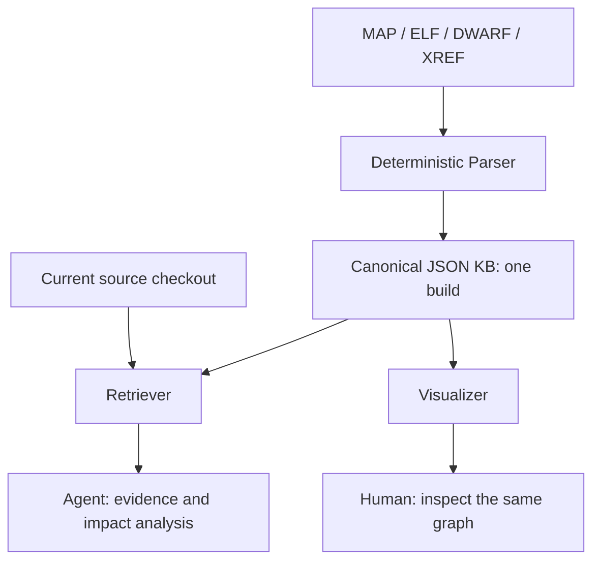

# GHS Xref Parser Output — Core Mindset

The knowledge database (KB) is a structured map of one compiled build, not a copy of the source or a complete runtime model. Its purpose is to help identify what may be affected when a function, variable, or other software entity changes.

## 1. Components and responsibilities

| Component | What it does and why it is used |
| --- | --- |
| Compiler/linker artifacts | Supply build evidence: symbols, addresses, sizes, object ownership, source mappings, and cross-references where available. |
| Parser | Deterministically export that evidence into nodes, relationships, and provenance. It establishes the recorded graph; the Agent does not replace it. |
| Retriever | Resolve entities and retrieve focused context, incoming/outgoing references, relation evidence, and relevant source. Use it to avoid loading the entire KB. |
| Visualizer | Display the same KB for human exploration; do not introduce a separate dependency database or interpretation. |
| Agent | Explain retrieved facts, inspect relevant source, and assess potential impact without inventing missing relationships. |

This document explains the Parser's output, not its CLI. Obtain Parser arguments from verified executable help or usage documentation. For Retriever invocation and all methods, read [GHS_XREF_RETRIEVER_INSTRUCTION.md](GHS_XREF_RETRIEVER_INSTRUCTION.md).

## 2. Read the graph correctly

| Concept | Meaning and interpretation |
| --- | --- |
| Node | A module, file, function, variable, or other recorded entity. Use its UUID for identity within the loaded snapshot; names are search/display labels and may repeat. |
| Reference edge | `A → B` means A references B. Outgoing traversal finds A's dependencies; incoming traversal finds its dependents and potential impact candidates. |
| Ownership | `contains`, parent functions, and lexical scopes describe structure. A reference to a function does not establish lexical containment. |
| Provenance | Preserve the available object/source identity, binary address, source location, and MAP/ELF evidence so a relationship can be traced. Missing locations remain unknown. |

A module represents a linker object, not necessarily exactly one C file or one AUTOSAR component. Treat an edge as a reference unless separate evidence confirms a call or read/write access. Keep UUIDs tied to their snapshot; resolve them again after regeneration.

## 3. Keep the build boundary explicit

- Use one canonical JSON KB per build across the Retriever, Visualizer, and Agent. Never manually alter generated relationships or create competing dependency rules.
- Build configuration, defines, compiler options, and linked objects determine the exported graph. Another configuration can produce different nodes and relationships.
- When build artifacts change, regenerate the KB and reload its consumers. Parsing old artifacts again does not compile or verify new source changes.
- Source excerpts come from the current checkout; the graph describes its recorded build. Verify their correspondence, or distinguish source observations from build facts.
- Coverage depends on the artifacts. Missing debug information, optimization, and unbuilt variants limit what can be established; an absent edge does not prove independence.

## 4. Use the evidence for analysis

1. Identify the build and coverage, then resolve the requested entity without confusing duplicate names.
2. Choose the smallest relevant query: incoming references for potential impact, outgoing references for dependencies, or local context for ownership.
3. Inspect relation evidence and relevant definition/use-site source; selectively expand only when indirect relationships matter.
4. Report what the evidence establishes, what remains uncertain, and what verification is needed. A dependency path does not prove runtime execution, a defect, or a behavioral change.

**Core rule:** Prefer compiler/linker evidence over source-code guessing. The Retriever finds recorded facts; the Agent reasons from them. Unknown information stays unknown.
